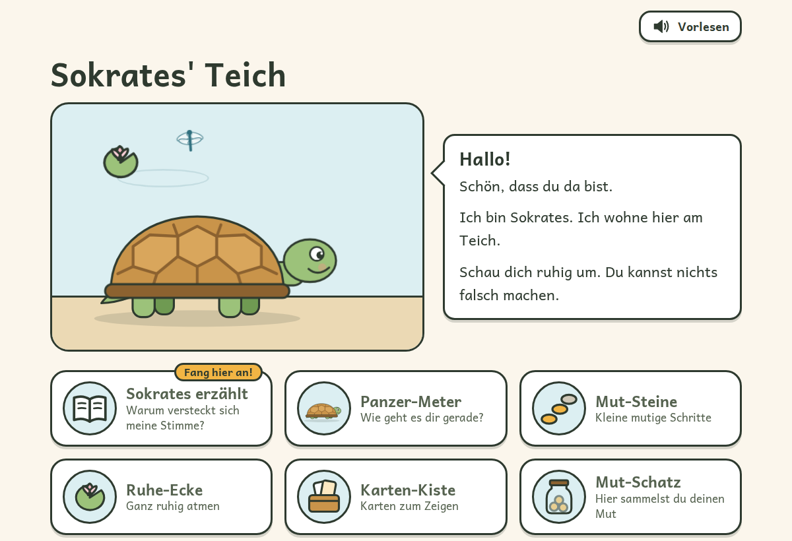
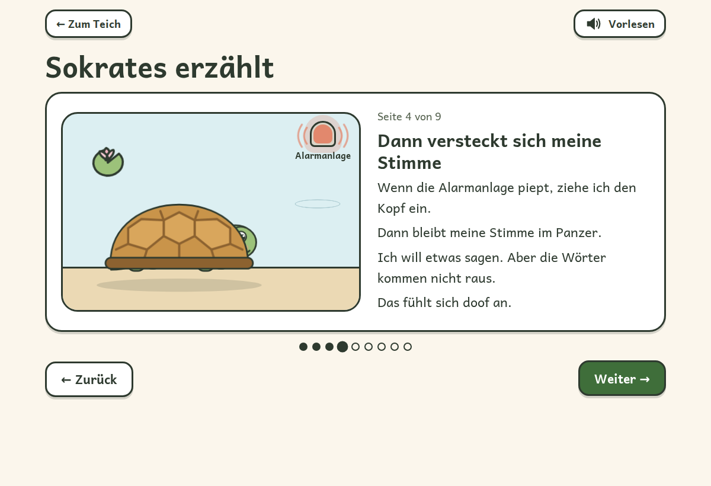
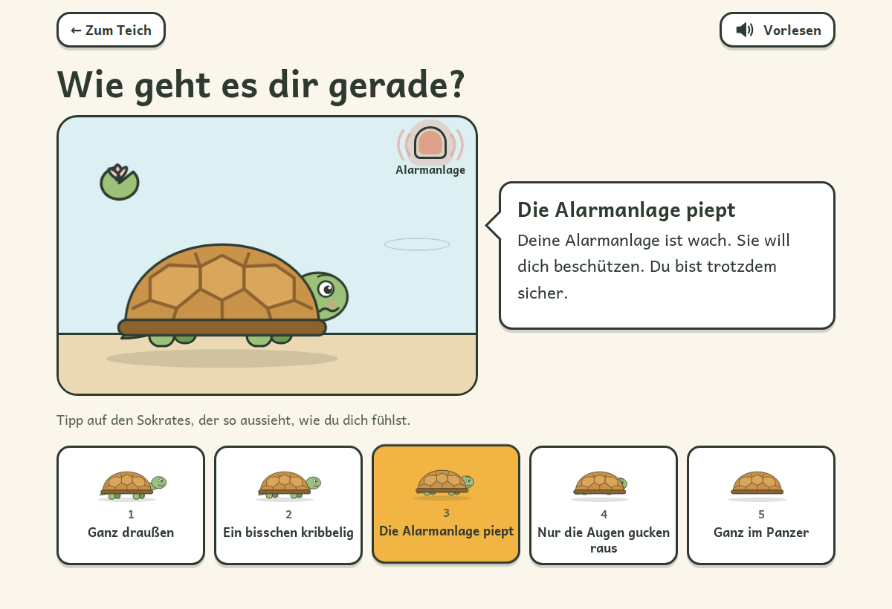
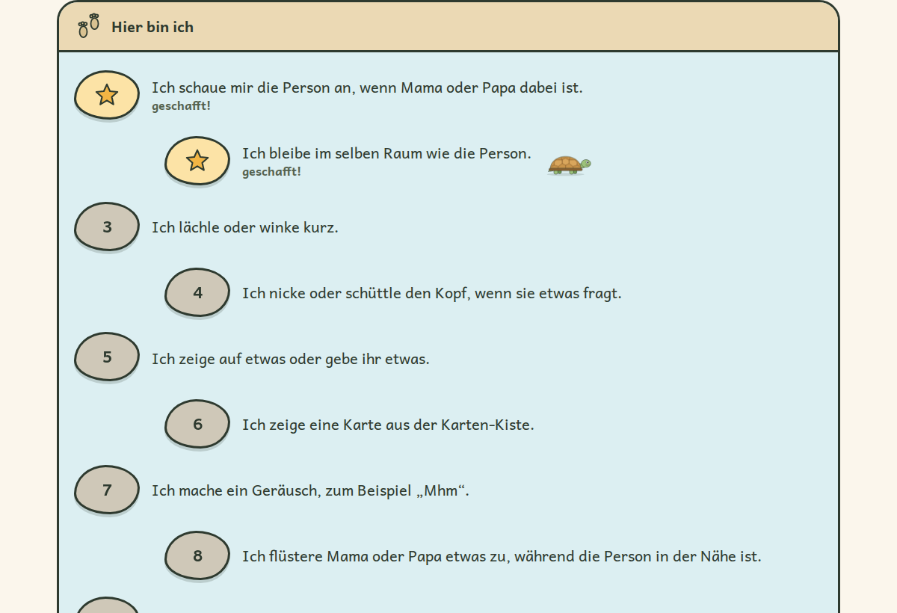
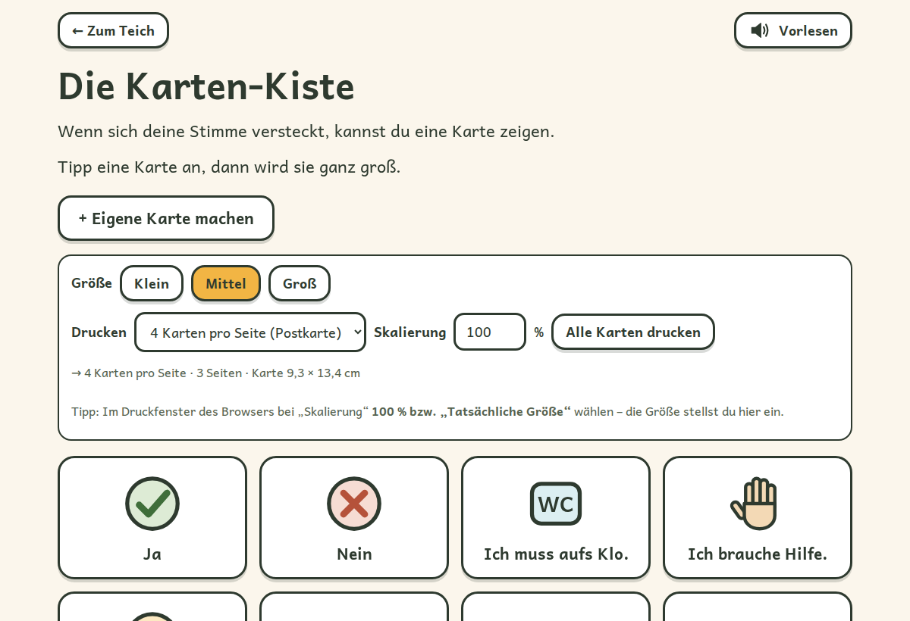
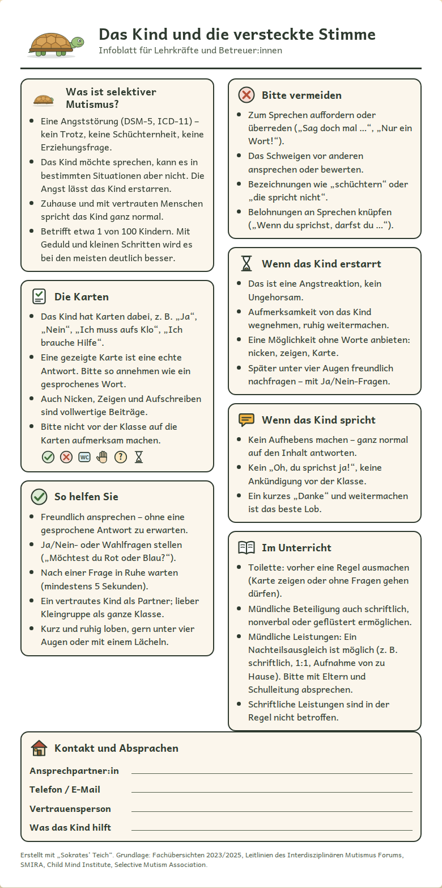

# Sokrates' Teich

**Eine kleine, liebevolle Webseite für Kinder mit selektivem Mutismus – und für die Erwachsenen um sie herum.**

Sokrates ist eine Schildkröte. Wenn seine *Alarmanlage* piept, zieht er den Kopf in den Panzer – und seine
Stimme bleibt drinnen. In kleinen Schritten kommt er wieder heraus. Mit Sokrates können Kinder verstehen,
was in ihnen passiert, Gefühle **ohne Worte** zeigen und kleine Mut-Schritte sammeln.



- läuft **offline** – einfach `index.html` im Browser öffnen, nichts installieren
- **keine Daten verlassen den Computer**, kein Konto, kein Tracking
- fordert das Kind **nie** zum Sprechen auf, nutzt **kein Mikrofon**
- für Leseanfänger (etwa 7–10 Jahre), mit Vorlesefunktion
- mit Material für **Eltern und Lehrkräfte** zum Ausdrucken
- kostenlos und frei unter der [MIT-Lizenz](LICENSE)

> **Wichtig:** Sokrates' Teich ist **keine Therapie** und ersetzt keine Fachleute.
> Bitte den Abschnitt [Was diese Seite nicht ist](#was-diese-seite-nicht-ist) lesen.

---

## Schnellstart

1. Auf dieser Seite oben auf **„Code“ → „Download ZIP“** klicken.
2. Die ZIP-Datei entpacken.
3. **`index.html` doppelklicken.** Fertig.

Empfohlen: **Microsoft Edge** (natürlichste Vorlesestimmen) oder Chrome/Firefox, auf PC oder Tablet.
Eine ausführliche Schritt-für-Schritt-Anleitung für Eltern steht in **[ANLEITUNG.md](ANLEITUNG.md)**.

---

## Was es gibt

| Ort | Wofür |
|---|---|
| **Sokrates erzählt** | Ein Bilderbuch in 9 Seiten: die Alarmanlage im Kopf, warum sich die Stimme versteckt, „Das ist nicht deine Schuld“, „Langsam ist auch mutig“. |
| **Panzer-Meter** | Gefühle zeigen ohne Worte: Sokrates zieht sich in 5 Stufen in den Panzer zurück. |
| **Mut-Steine** | Kleine Schritte über den Teich – drei fertige Wege (*Jemand Neues*, *Viele Menschen*, *Ein neuer Ort*) und ein eigener Weg. Die ersten Steine sind immer ohne Worte. |
| **Ruhe-Ecke** | Atmen mit Sokrates und eine „Panzer-Pause“. |
| **Karten-Kiste** | Karten zum Zeigen („Ja“, „Nein“, „Ich muss aufs Klo“, „Ich brauche Hilfe“ …), groß auf dem Bildschirm, vorlesbar und druckbar in jeder Größe. Eigene Karten möglich. |
| **Mut-Schatz** | Jeder mutige Moment – auch Nicken, Zeigen oder Hingehen – wird ein Steinchen im Glas. |
| **Für Erwachsene** | Hintergrundwissen, „Was hilft – was eher nicht“, Hilfe finden, Einstellungen, Sicherung. |
| **Für Lehrkräfte** | Ein **Infoblatt (1 Seite A4)** und **8 Erklär-Karten** für Schule, Hort und Vereine – auf das Kind zugeschnitten. |

<table>
<tr>
<td></td>
<td></td>
</tr>
<tr>
<td></td>
<td></td>
</tr>
</table>

<details>
<summary>Infoblatt für Lehrkräfte (Beispiel)</summary>



</details>

---

## Was diese Seite nicht ist

Bitte lesen, bevor ihr die Seite nutzt oder weitergebt.

- **Keine Therapie.** Selektiver Mutismus ist eine ernstzunehmende Angststörung. Die Seite kann eine
  Behandlung begleiten, aber nicht ersetzen. Erste Anlaufstelle ist die Kinderärztin oder der Kinderarzt;
  behandelt wird selektiver Mutismus vor allem von Kinder- und Jugendlichenpsychotherapeut:innen und
  Logopäd:innen mit Mutismus-Schwerpunkt.
- **Kein Diagnose-Werkzeug.** Die Seite stellt nicht fest, ob ein Kind selektiven Mutismus hat.
- **Kein Medizinprodukt.** Sie misst, bewertet und überträgt keine Gesundheitsdaten.
- **Nicht fachlich begutachtet.** Die Inhalte wurden von Eltern mit Unterstützung einer KI aus Fachquellen
  zusammengestellt (siehe [Quellen](#inhalte-und-quellen)). Sie wurden **nicht** von Therapeut:innen geprüft.
  Rückmeldungen von Fachleuten sind ausdrücklich willkommen.
- **Kein Übungsprogramm mit Zielvorgaben.** Die Mut-Steine sind Vorschläge. Tempo und Schritte bestimmt das
  Kind – im besten Fall abgestimmt mit der behandelnden Fachperson.
- **Nichts für Notfälle.** Bei akuten Krisen bitte sofort ärztliche Hilfe holen.

Die Seite wird ohne jede Gewährleistung bereitgestellt (siehe [LICENSE](LICENSE)).

---

## Für wen?

- **Kinder** mit selektivem Mutismus im Grundschulalter – am besten zuerst **gemeinsam** mit einem Erwachsenen.
- **Eltern**, die ihrem Kind das Schweigen erklären und kleine Schritte begleiten möchten.
- **Lehrkräfte, Hort- und Vereinsbetreuer:innen**, die das Kind besser verstehen wollen (Infoblatt, Erklär-Karten).
- **Fachleute**, die ein kindgerechtes, kostenloses Begleitmaterial suchen.

## Grundsätze

Die Gestaltung folgt dem, was in der Fachliteratur übereinstimmend empfohlen wird:

- **Kein Druck.** Die Seite fordert nie zum Sprechen auf. Es gibt keine Fehler, keine Punkte zum Verlieren,
  keine Zeitlimits.
- **Nicht sprechen ist auch Kommunikation.** Zeigen, Nicken, Karten und Flüstern zählen als echte Schritte.
- **Kleine Schritte.** Mut wird in machbaren Stufen geübt, und jede Form von Mut wird gewürdigt.
- **Nicht deine Schuld.** Die Angst wird als übervorsichtige „Alarmanlage“ erklärt – nicht als Fehler des Kindes.
- **Ruhig.** Langsame, freundliche Bewegungen; ein Ruhig-Modus schaltet Animationen ab.

## Datenschutz

Alles bleibt auf dem Gerät. Fortschritt und Einstellungen (z. B. der Name des Kindes) liegen nur im
Speicher des Browsers (`localStorage`). Die Seite lädt nichts aus dem Internet und sendet nichts.

Ausnahme beim Vorlesen: Online-Stimmen (z. B. die „Natural“-Stimmen in Edge oder „Google Deutsch“ in Chrome)
werden vom Browser-Hersteller erzeugt; dabei wird der vorgelesene Text an dessen Dienst übertragen. Wer das
nicht möchte, wählt im Elternbereich eine Stimme ohne „Online“ bzw. „Google“ im Namen.

## Anpassen

- **Name des Kindes**, Vorlesestimme, Tempo, Bewegung, Glasgröße und Belohnung: im Bereich *Für Erwachsene*.
- **Alle Kindertexte** stehen in einer Datei: [`assets/js/inhalt.js`](assets/js/inhalt.js). Mit einem
  Texteditor öffnen, Text zwischen den Anführungszeichen ändern, speichern, Seite neu laden.
- **Fortschritt sichern** und auf ein anderes Gerät übertragen: *Für Erwachsene → Sicherung speichern/laden*.

## Inhalte und Quellen

Die Inhalte beruhen auf einer dokumentierten Recherche mit Quellenangaben und einer Einschätzung der
Beweislage: [`docs/recherche/01-synthese.md`](docs/recherche/01-synthese.md). Dazu gehören u. a.
systematische Übersichtsarbeiten (2023, 2025), die Leitlinien des Interdisziplinären Mutismus Forums,
die Selective Mutism Information & Research Association (SMIRA), das Child Mind Institute und die
Selective Mutism Association.

Die Originalquellen konnten bei der Recherche nur über Suchergebnisse geprüft werden; diese Einschränkung
ist dort offen benannt.

## Technik

Reines HTML, CSS und JavaScript – ohne Framework, ohne Build-Schritt, ohne Server. Läuft direkt von der
Festplatte (`file://`). Alle Bilder sind selbst gezeichnete SVG-Grafiken.

```text
index.html               Seite mit allen Zeichnungen (SVG)
assets/css/style.css     Gestaltung
assets/js/inhalt.js      alle Kindertexte – hier anpassen
assets/js/*.js           je ein Bereich (geschichte.js, mut-steine.js …)
assets/fonts/            Schrift Andika (SIL Open Font License)
docs/                    Designbrief, Seitenstruktur, Textentwurf, Recherche, Bilder
```

Geprüft im Browser (Chromium): alle Bereiche auf PC- und Handy-Breite, Bedienung per Tastatur,
Ruhig-Modus, Druck (Kartengrößen und Skalierung, Infoblatt auf einer Seite) und eine automatische
Barrierefreiheits-Prüfung nach WCAG 2 AA (axe-core) ohne Befund. Nicht geprüft: echte Screenreader.

## Mitmachen

Rückmeldungen, Verbesserungen und Übersetzungen sind willkommen – besonders von Betroffenen, Eltern,
Lehrkräften und Fachleuten. Bitte über **Issues** oder **Pull Requests**.

Bei Textänderungen bitte die Schreibregeln in [`docs/INHALT.md`](docs/INHALT.md) beachten
(kurze Sätze, bekannte Wörter, nie „du musst“, kein Sprechdruck).

## Wie das entstanden ist

Die Seite ist als Projekt einer Familie für das eigene Kind entstanden und wurde mit Unterstützung von
Claude (KI von Anthropic) entwickelt – nach dem Werkzeugkasten [KI-Regeln](https://github.com/Borstwerk/KI-Regeln):
erst Recherche, dann Designbrief, Greybox, Texte, Umsetzung und Prüfung im Browser.
Designentscheidungen und Hintergründe: [`docs/`](docs/).

## Lizenz

[MIT](LICENSE) – frei nutzbar, veränderbar und weitergebbar, auch für Schulen, Praxen und Vereine.
Ausnahme: die Schrift Andika (SIL Open Font License 1.1), siehe [THIRD-PARTY-NOTICES.md](THIRD-PARTY-NOTICES.md).

---

### In English

*Sokrates' Teich* ("Socrates' Pond") is a free, offline web page in **German** for children with
**selective mutism** and the adults around them. A turtle named Sokrates explains the "alarm system" in
the head, lets children show feelings without words, practise small brave steps and collect courage.
It never asks the child to speak, uses no microphone and stores everything locally. It includes printable
communication cards and an information sheet for teachers. **It is not therapy and not a medical device.**
MIT licensed.
